## Code Quality Module Practical Task

### Install Sonar
To run Sonar on local environment you can use provided docker-compose.yaml file. It contains all necessary configuration.

To start sonar please run in folder where `docker-compose` file is located:

```
docker-compose up
```

In case you get error regarding lack of virtual memory please run:
```
sudo sysctl -w vm.max_map_count=262144
```

after that please re-run docker-compose up

To shut-down env please run 

```
docker-compose down
```

### Intial configuration and usage

By default sonar will be available at `localhost:9000`. If you wish to change port please update mapping in docker-compose file `"9000:9000"` and again restart containers with:

```
docker-compose down && docker-compose up
```

Default login and passowrd are `admin:admin`. After first login you will be asked to change password.

Then you will be able to configure your first project and token for it.

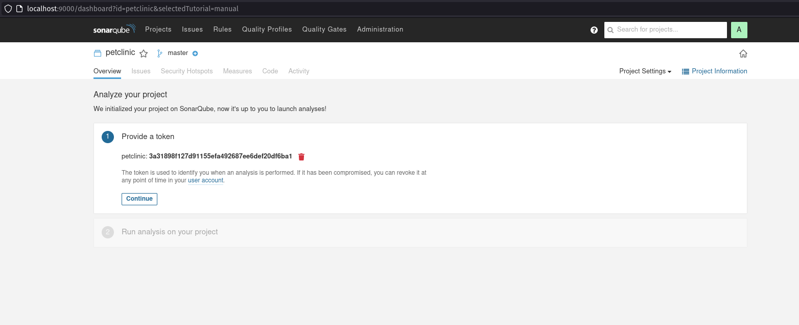

In my case token was: `3a31898f127d91155efa492687ee6def20df6ba1`

After that you will be asked what build system you use and display you how to run sonar analyze.

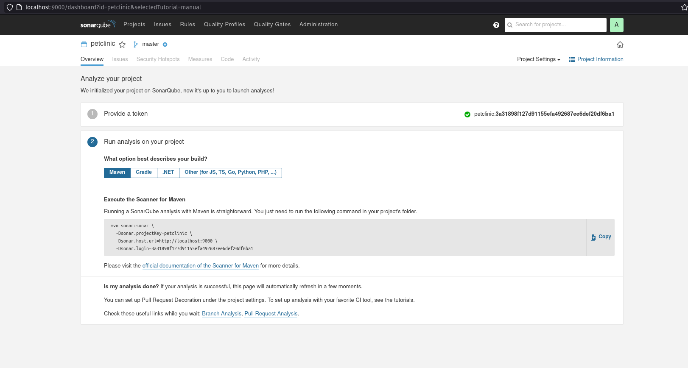

### Disclaimer
For this task I used petclinic application from Task1(docker/k8s/helm). The code changes can be found in branch `main` however most of changes and experiments were run localy without commits.

### Maven configuration

To apply sonar you need to configure `sonar-maven-plugin`

```
    <pluginManagement>
      <plugins>
        <plugin>
          <groupId>org.sonarsource.scanner.maven</groupId>
          <artifactId>sonar-maven-plugin</artifactId>
          <version>3.7.0.1746</version>
          <configuration>
            <sonar.core.codeCoveragePlugin>jacoco</sonar.core.codeCoveragePlugin>
            <sonar.dynamicAnalysis>reuseReports</sonar.dynamicAnalysis>
            <sonar.language>java</sonar.language>
            <sonar.jacoco.itReportPath>
                ${basedir}/target/jacoco.exec
            </sonar.jacoco.itReportPath>
            <sonar.exclusions>
                **/test/*
            </sonar.exclusions>
            <sonar.sources>src/main/java</sonar.sources>
        </configuration>
        </plugin>
      </plugins>
    </pluginManagement>
```

In case you do not want to pass all sonar params like url, token, passwords and so on you can specify them in properties section:

```
<properties>    
    <sonar.host.url>http://localhost:9000/</sonar.host.url>
    <sonar.jdbc.url>jdbc:postgresql://localhost:9000/sonar</sonar.jdbc.url>
    <sonar.jdbc.driver>org.postgresql.Driver</sonar.jdbc.driver>
    <sonar.jdbc.username>sonar</sonar.jdbc.username>
    <sonar.jdbc.password>sonar</sonar.jdbc.password>
    <sonar.exclusions>org/binarytherapy/generated/**/*, **/GuiceBindComposer.java</sonar.exclusions>
    <sonar.dynamic>reuseReports</sonar.dynamic>
    <sonar.projectKey>petclinic</sonar.projectKey>
    <sonar.login>8d30d89df6fd337736e55a15d6d96192db98ba22</sonar.login>
</properties>
```

Also you need to add specific jacoco plugin to generate report and analyses 

```
      <plugin>
        <groupId>org.jacoco</groupId>
        <artifactId>jacoco-maven-plugin</artifactId>
        <version>${jacoco.version}</version>
        <executions>
          <execution>
            <goals>
              <goal>prepare-agent</goal>
            </goals>
          </execution>
          <execution>
            <id>report</id>
            <phase>prepare-package</phase>
            <goals>
              <goal>report</goal>
            </goals>
          </execution>
        </executions>
      </plugin>
```

After all this done you need to build application `./mvnw clean package` and then send reports to sonar `./mvnw sonar:sonar`

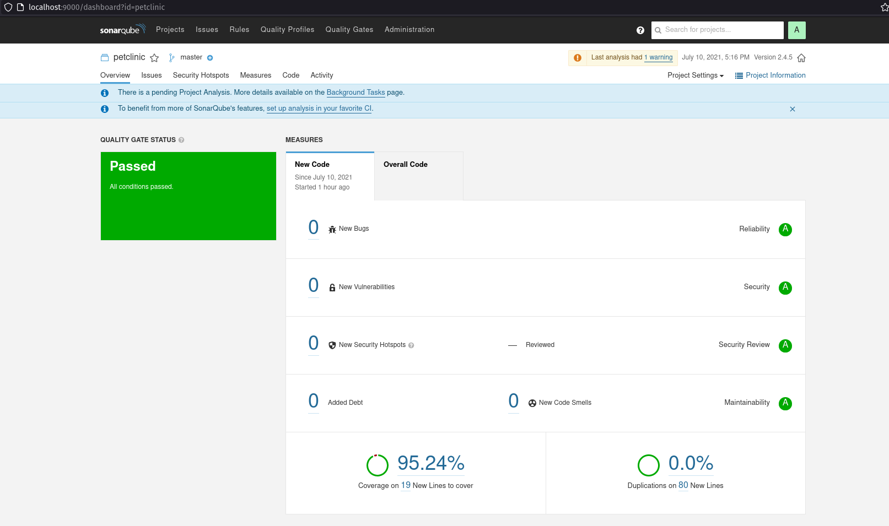

## Task 2

### Create a new maven project with a few (10+) issues, e.x. :
Add switch expression with default at the top and other small warnigns/vularnabilities

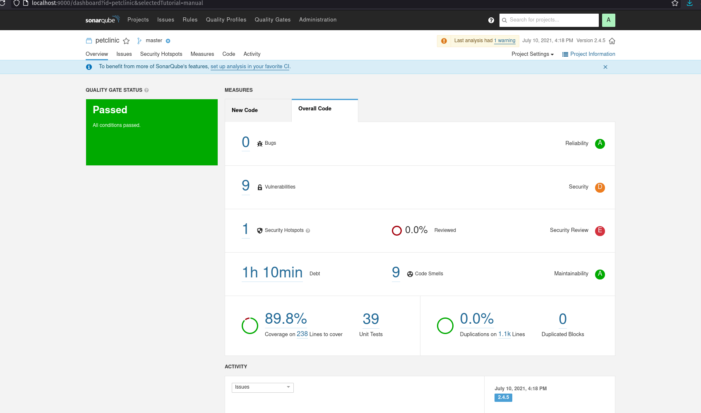

Add annotation and then you need to rebuild your app `./mvnw clean package` to regenerate report and after report was regenerated then you need to push it again in sonar
`./mvnw sonar:sonar`

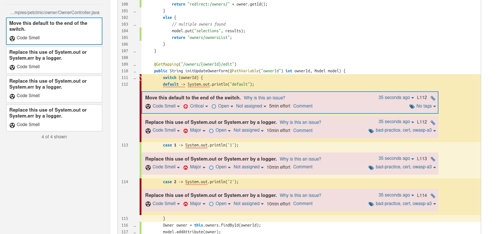


### Try to skip all issues with @SuppressWarnings

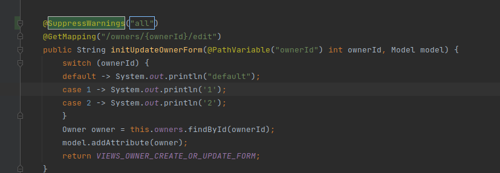

Add annotation and then you need to rebuild your app `./mvnw clean package` to regenerate report and after report was regenerated then you need to push it again in sonar
`./mvnw sonar:sonar`

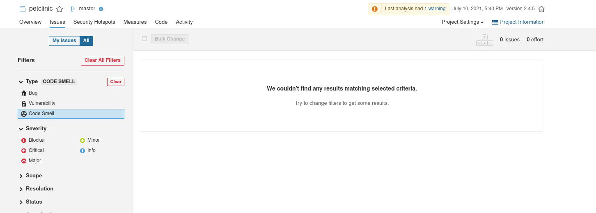


### Remove @SuppressWarnings for project from previous section
### Create a new Sonar java profile (copy it from default java profile)
### Deactivate rules for issues from previous section
### Link new profile to your project

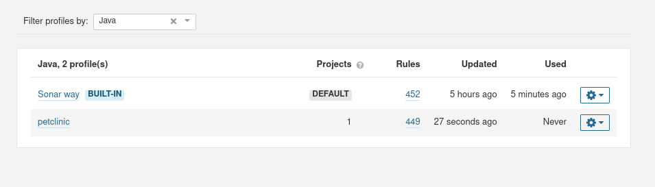
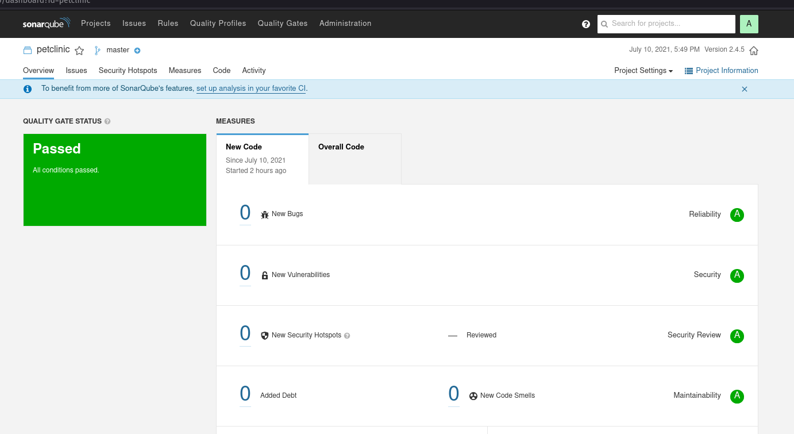


### Create a new Quality Gate with:
- Duplicated code (> 10)
- Issues (> 20)
- Code smells (> 40)
- Bugs (> 35)
- Unit test succsess (< 40)

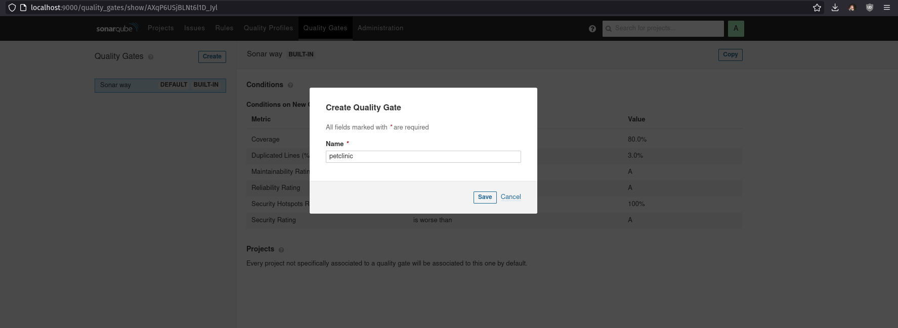
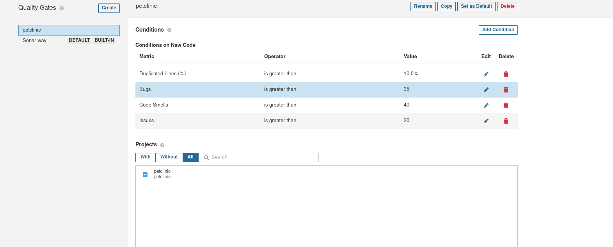
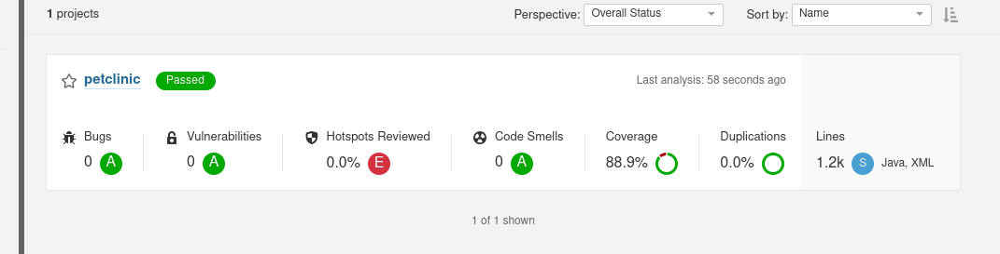