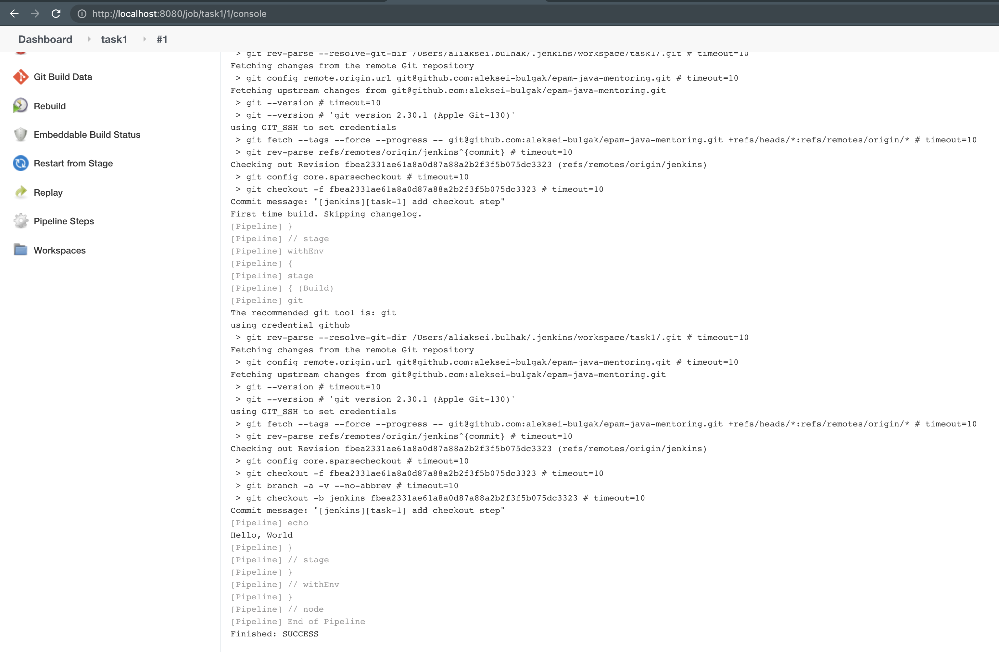

### Jenkins task

#### Intro
For current task was used local jenkins installation because jenkins in docker does not fully support docker.
#### Task 1

1. After jenkins was installed you need to configure credentials for github


2. After credentials were configured then you will be able to create sample job(in my case I used Pipeline)


Contents of Jenkinsfile should be smth like this:

```
pipeline{
    agent any

    stages{
        stage("Build"){
            steps{
                git branch: 'jenkins', credentialsId: 'github', url: 'git@github.com:aleksei-bulgak/epam-java-mentoring.git'
                echo "Hello, World"
            }
        }
    }
}
```
1. Then you can trigger 





#### Task 2

Configure docker credentials in jenkins:
1. Go to docker hub `https://hub.docker.com/settings/security` and create new `Access Token`.
2. Create new credentials with your dockerHub username and token from previous step as password


Create Jenkins pipleine job(It would be better to move all account/dockerhub specific variables to the separate variables or jenkins job parameters):
```
def image = null;

pipeline{
    agent any

    stages{
        stage("Build"){
            steps{
                git branch: 'jenkins-2', credentialsId: 'github', url: 'git@github.com:aleksei-bulgak/epam-java-mentoring.git'
                
                script {
                    env.PATH = "${env.PATH}:/usr/local/bin:/usr/bin:/usr/sbin:/sbin"
                    def dockerfile = 'Dockerfile.withBuild'
                    image = docker.build("alekseibulgak/petclinic:${env.BUILD_ID}")
                }
            }
        }

        stage("Push") {
            steps {
                script {
                    withCredentials([usernamePassword(credentialsId: 'dockerhub_id', passwordVariable: 'password', usernameVariable: 'username')]) {
                        sh"""
                            docker login -u ${username} -p ${password} https://index.docker.io/v1/
                            docker push alekseibulgak/petclinic:${env.BUILD_ID}
                            docker tag alekseibulgak/petclinic:${env.BUILD_ID} alekseibulgak/petclinic:latest
                            docker push alekseibulgak/petclinic:latest
                        """
                    }
                }
            }
        }
    }
}
```


as a result new image was published in docker hub


[to check image please click this link](https://hub.docker.com/r/alekseibulgak/petclinic/tags?page=1&ordering=last_updated)

#### Task 3

After you install plugins descibed in task you also need to add credentials with your kube config(in my case I used docker-desktop/kubernetes available as part of docker for mac instead of minikube)


Jenkisfile configuration:
```
def image = null;

pipeline{
    agent any

    stages{
        stage("Build"){
            steps{
                git branch: 'jenkins-3', credentialsId: 'github', url: 'git@github.com:aleksei-bulgak/epam-java-mentoring.git'
                
                script {
                    env.PATH = "${env.PATH}:/usr/local/bin:/usr/bin:/usr/sbin:/sbin"
                    def dockerfile = 'Dockerfile.withBuild'
                    image = docker.build("alekseibulgak/petclinic:${env.BUILD_ID}")
                }
            }
        }

        stage("Push") {
            steps {
                script {
                    withCredentials([usernamePassword(credentialsId: 'dockerhub_id', passwordVariable: 'password', usernameVariable: 'username')]) {
                        sh"""
                            docker login -u ${username} -p ${password} https://index.docker.io/v1/
                            docker push alekseibulgak/petclinic:${env.BUILD_ID}
                            docker tag alekseibulgak/petclinic:${env.BUILD_ID} alekseibulgak/petclinic:latest
                            docker push alekseibulgak/petclinic:latest
                        """
                    }
                }
            }
        }

        stage("Deploy") {
            steps {
                script {
                    kubernetesDeploy configs: 'infrastructure/k8s/*', deleteResource: true, kubeconfigId: 'docker-desktop'
                }
            }
        }
    }
}
```

If you use k8s resources from task1 then you need to specify docker image in docker hub format in my case:
```
    image: alekseibulgak/petclinic:latest
    imagePullPolicy: Always
```


